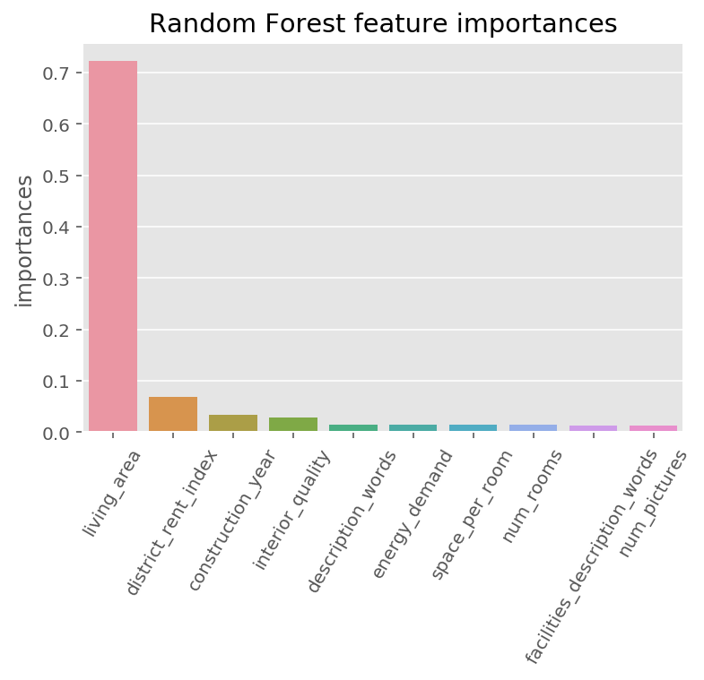

# Predicting monthly rent prices for real estate objects in the city Berlin

(student project)

This project addresses the prediction of monthly rent prices for real estate objects in the city Berlin, Germany. The jupyter notebook content includes data preprocessing, exploratory data analysis, feature engineering, modeling and evaluation.

## Project Objective

The objective of this project is to predict the monthly rent prices of real estate objects in the capital city Berlin of the country Germany. Thereby, the rent prices are given in the currency € and the **target feature represents the base rent in €**. The prediction outcome of such a model enables landlords and tenants to appropriately estimate the rent of a given property. In addition to a more precise estimation of the rent, the determination of the rent is also accelerated in order to advertise the object on real estate platforms.

## Results

Throughout this project, three different regression techniques were compared which include *Decision Trees*, *Support Vector Machines* and *Gradient Boosting*. The optimal model hyperparameters were identified by applying gridsearch for each model pipeline in a 5-fold cross-validation fashion using the negative mean absolute error as scoring function. For evaluation reasons, the dataset was splitted into a train and test dataset with a test ratio of 30%.

As a result, the gradient boosting regressor outperformed the decision tree and support vector machine with the following hyperparameters:
- *learning_rate = 0.05*
- *max_depth = 5*
- *n_estimators = 1000*

The mean absolute error (MAE) of the tuned models on the test set are as follows:
- Decision Tree: 235.97 €
- Support Vector Machine: 198.51 €
- **Gradient Boosting: 187.20 €**

## Limitations

In this project, only a subset of the full dataset was used for learning and model evaluation. A larger training dataset might result into a lower MAE since 3500 observations poses a rather small dataset.

Moreover, only the city Berlin was considered of the available data. The usage of all states could contribute to a better generalization of the data by the models.

For the sake of clarity the *date* feature as time component was removed. Since rent prices usually increase over time, the time component might lead to more accurate prediction results especially in production.

## Data

The dataset **Apartment rental offers in Germany** is provided by the data science community platform Kaggle and consists originally of 268,850 observations and 49 feature columns. In this project, only the state Berlin as the capital city of Germany is considered in order to reduce the amount of data and to investigate the prediction performance of one single city. Therefore, the used dataset was prepared by filtering and selecting the state Berlin which resulted in 10,406 observations and 49 feature columns. The features contain most of the important properties such as living area, location (state, zip code, district, street, house number, etc), energy type, condition, kitchen, number of rooms, rent and so on.

The original dataset can be found [here](https://www.kaggle.com/corrieaar/apartment-rental-offers-in-germany) where you also can find more information about the scraping process.

The feature importances by *RandomForestRegressor* for the best 10 descriptive features are as follows:

